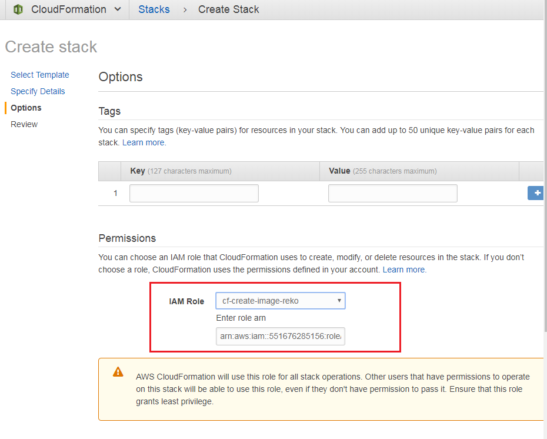

# CS4296_Project - Online Image Recognition

## Overview

<kbd></kbd>

## Try the api

I have built the api that you can try it.

* Upload - https://p81v4825wl.execute-api.us-east-1.amazonaws.com/prod/upload
* Get labelled results - https://p81v4825wl.execute-api.us-east-1.amazonaws.com/prod/labelled-result?filename=
* Get uploaded image - https://p81v4825wl.execute-api.us-east-1.amazonaws.com/prod/uploaded-image?filename=

Please follow this [step](#5-test-the-api-using-postman) to try the api by using Postman.

## Limitation

Service|Limitations|Remarks
---|---|---
Lambda|Max payload: 6MB|https://docs.aws.amazon.com/en_us/lambda/latest/dg/limits.html
API Gateway|Max payload: 10MB<br>Integration timeout: 29s|https://docs.aws.amazon.com/en_us/apigateway/latest/developerguide/limits.html
Rekognition|Max image size: 15MB|https://docs.aws.amazon.com/en_us/rekognition/latest/dg/limits.html

So the safe image upload request should be <=5MB within 25s.

## The backend setup guide (You can try it. It's up to you)

### 1. Download the zip file of source code (CS4296_Project.zip)

https://github.com/addisn/CS4296_Project/releases

### 2. Login your AWS console & goto US East (N. Virginia) or US West (Oregon)

### 3. Create a S3 bucket for storing source code

Create a bucket in S3 and upload the CS4296_Project.zip to this bucket.

This bucket is used for storing the source code for lambda. Please note down your **bucket name** for later step.

For example:

<kbd></kbd>

### 4. Create an AWS IAM Role for CloudFormation

1. Goto AWS IAM and click Roles on left hand side and click Create role

2. Select CloudFormation

<kbd></kbd>

3. Proceed next

When you see this page, please enter the name for the role.

<kbd></kbd>

4. Grant permission for the role

<kbd></kbd>

Assign the following policy to the role

<kbd></kbd> 

Then, add inline policy

<kbd></kbd> 

Paste the following json as picture and name the policy with "cf-createchangeset"
```json
{
    "Version": "2012-10-17",
    "Statement": [
        {
            "Effect": "Allow",
            "Action": [
                "cloudformation:CreateChangeSet"
            ],
            "Resource": [
                "*"
            ]
        }
    ]
}
```

<kbd></kbd>


### 5. Create stack on CloudFormation

1. [Download the CreateStack.yaml](https://github.com/addisn/CS4296_Project/tree/master/CloudFormation%E2%80%8EStack)

2. 

<kbd></kbd>

3. Enter the new stack name, bucket name of source code & zip name of source code

<kbd></kbd>

4. Select the IAM role for CloudFormation you have created previous and click next

<kbd></kbd>

5. 

<kbd></kbd>

6. Wait it for completion

If you see "CREATE_COMPLETE", that means CloudFormation has created the required services for you.
<kbd></kbd>

7. Click the stack and view the result

Please find the ApiUrl from the output.

For example:

<kbd></kbd>

### 5. Test the api using Postman

1. Install the [Postman](https://chrome.google.com/webstore/detail/postman/fhbjgbiflinjbdggehcddcbncdddomop) if you do not have it.

2. Test upload image

(POST method, single file only)

The test url should be https://{your ApiUrl from CloudFormation output}/prod/upload

For example:

<kbd></kbd>

You should get the result json with imageFile in {md5 of the image}.jpg or {md5 of the image}.png value

3. Get the recognition result of uploaded image

(GET method, querystring: filename)

The request url should be https://{your ApiUrl from CloudFormation output}/prod/labelled-result

<kbd></kbd>


### 6. Delect the Services after this project ended

**If your free tier plan is ended, those may services charge you money!**

You should delete all services after this project CS4296 ended.

CloudFormation can help you delete all services which created by the stack itself automatically.

**You should also delete all S3 buckets manually.**

<kbd></kbd>

If you see the "DELETE_FAILED", you should follow the CloudFormation to **delete remaining services manually**.

<kbd></kbd>

### Links

[AWS Serverless Application Model (SAM)](https://github.com/awslabs/serverless-application-model/blob/master/versions/2016-10-31.md#awsserverlessapplication)